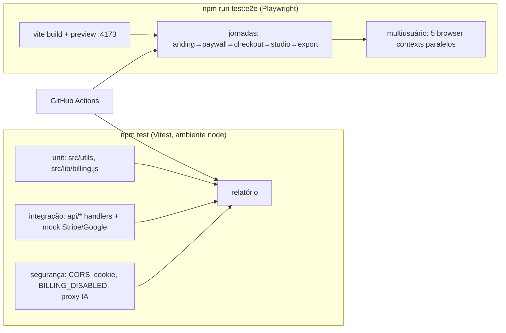

# TDD — Suite de Testes de Confiança

**PRD de origem:** docs/product/PRD-suite-testes-confianca.md
**Status:** Rascunho
**Auditorias:** docs/audit.md · docs/audit-produto.md

## 1. Visão da solução

Três camadas de teste sobre o código existente, sem refatorar o monólito: **unitário** (módulos puros de `src/utils` e `src/lib`), **integração** (handlers serverless de `api/` invocados diretamente com req/res fake e Stripe mockado) e **E2E** (Playwright contra o build real, com rotas `/api/*` interceptadas). Um comando (`npm test`) roda unit+integração; `npm run test:e2e` roda jornadas; CI executa ambos em push. Concorrência multiusuário coberta em integração (N handlers em paralelo) e em E2E (N contexts de browser isolados).

## 2. Arquitetura

- `tests/unit/**` — funções puras, zero mock de rede.
- `tests/integration/**` — importa handlers de `api/` (são funções `(req,res)` exportadas), injeta `req`/`res` fakes (`tests/helpers/http.js`) e mocka o SDK `stripe` via `vi.mock`. Sem servidor HTTP real.
- `tests/e2e/**` — Playwright; `page.route('/api/**')` simula respostas de billing/auth para jornadas determinísticas.
- `tests/helpers/` — fábrica de req/res, fábrica de assinatura Stripe fake, fábrica de cookie válido (usa `createAccessToken` real com `ACCESS_COOKIE_SECRET` de teste).

## 3. Stack e dependências

| Camada | Escolha | Por quê |
|---|---|---|
| Runner unit/integração | **Vitest** | nativo do ecossistema Vite já usado; zero config de transform; `vi.mock` p/ SDK stripe |
| Ambiente | `node` (default) | módulos testados são puros ou serverless; sem DOM |
| E2E | **Playwright** (`@playwright/test`) | multi-context nativo (multiusuário), interceptação de rede, roda contra `vite preview` |
| Mock Stripe | `vi.mock('stripe')` + fixtures próprias | sem rede, sem conta; contrato pequeno (customers.list/create, subscriptions, checkout.sessions, billingPortal, webhooks.constructEvent) |
| CI | GitHub Actions | repo já no GitHub; runner ubuntu |

Novas devDependencies: `vitest`, `@playwright/test`. Nada em `dependencies`.

## 4. Modelo de dados

N/A — produto não tem banco. "Estado" testável = cookie `vc_access` (HMAC) + respostas Stripe mockadas + localStorage no E2E.

## 5. Contratos de API (alvo dos testes de integração)

Fonte: `api/lib/billing-handlers.js`, `api/lib/access.js`, `api/stripe/webhook.js`, `api/auth/*`, `api/anthropic/v1/messages.js`. Contratos exatos a congelar em teste:

| Endpoint | Casos |
|---|---|
| `GET /api/auth/session` | anônimo→`{active:false,status:'anonymous'}`; cookie válido+sub ativa→`{active:true,status,currentPeriodEnd}`; cookie válido sem sub→`inactive`; cookie adulterado→anonymous |
| `POST /api/stripe/checkout` | e-mail inválido→400; novo cliente→`{url,sessionId}`; sub já ativa→`{alreadyActive:true}`+Set-Cookie |
| `POST /api/stripe/confirm` | paga→`{active:true}`+Set-Cookie; não paga→402; `mode!=='subscription'`→400; sem sessionId→400 |
| `POST /api/stripe/webhook` | assinatura válida→200; inválida→400 |
| `POST /api/stripe/portal` | sem cookie→401; com cookie→`{url}` |
| `POST /api/auth/logout` | limpa cookie (Max-Age=0) |
| `GET /api/auth/google` + callback | state inválido→redirect `?login=invalid_state`; assinante→cookie+`?billing=restored&login=google`; sem sub→`?login=no_subscription` |
| `POST /api/anthropic/v1/messages` | sem chave própria + sem sessão→401; com sessão→usa env key; OPTIONS de origin fora da allowlist→sem `Access-Control-Allow-Origin` |

## 6. Integrações externas

- **Stripe**: mockado (DEC-002). Nenhum teste toca `api.stripe.com`.
- **Google OAuth**: mockado no fetch de token/userinfo (RF-05; pergunta aberta do PRD resolvida: E2E real de Google fora de escopo).
- **Anthropic/OpenAI/Z.ai/Kimi**: nunca chamados; E2E intercepta `/api/anthropic/*` e retorna fixture de geração.

## 7. Trade-offs e alternativas rejeitadas

| Decisão | Alternativa rejeitada | Motivo |
|---|---|---|
| **DEC-001** Vitest | Jest | Vite já é o build; Vitest reusa pipeline, ESM sem transform |
| **DEC-002** `vi.mock('stripe')` com fixtures | `stripe-mock` (docker) / conta test-mode real | RNF-02 (sem rede/conta), RNF-01 (velocidade), CI simples |
| **DEC-003** Handlers invocados direto (req/res fake) | subir servidor HTTP (supertest/vercel dev) | handlers já são funções puras `(req,res)`; menos infra, mais rápido; `vercel dev` exige login |
| **DEC-004** Playwright multi-context p/ multiusuário | k6/artillery (carga) | PRD exclui stress; objetivo é isolamento funcional de sessão (RF-11), não throughput |
| **DEC-005** E2E com `/api` interceptado | E2E contra Stripe test-mode real | determinismo + RNF-02; contrato da API já coberto na integração |
| **DEC-006** UI testada só por E2E | unit de componentes React do monólito | monólito de 18.5k linhas sem exports testáveis (audit-produto §3); custo/benefício ruim |
| **DEC-007** GitHub Actions | CI local só | PRD RNF-04; repo já no GitHub |

## 8. Estratégia de testes (mapa RF → camada)

| Camada | Cobre | RFs |
|---|---|---|
| Unit | `parsers`, `formats`, `schema-migration`, `brand-helpers`, `hooks-library`, `wcag`, `slide-design-system`, `src/lib/billing.js` | RF-03 |
| Integração | todos os endpoints da §5 + `access.js` (token válido/expirado/adulterado) + concorrência: 5× `checkout→confirm→session` em `Promise.all`, asserts de não-vazamento de `customerId`/e-mail entre respostas | RF-04..RF-11, RF-12..RF-14 |
| Segurança (integração) | CORS allowlist (origin fora → sem ACAO); `getSecret()` sem env → throw; `BILLING_DISABLED` + `VERCEL_ENV=production` → paywall ativo; proxy Anthropic anônimo → 401 | RF-12..RF-14, OB-04 |
| E2E | landing renderiza sem erro de console (RF-01); jornada compra (checkout mockado → `?billing=success` → studio); restauração; negação sem assinatura; logout; criar/editar carrossel e exportar PNG/ZIP válido (RF-02); paywall bloqueia UI (RF-15); 5 contexts paralelos comprando (RF-11 visual) | RF-01, RF-02, RF-07 (jornada), RF-11, RF-15 |

Bugs já corrigidos que ganham teste de regressão: `capRules`/`voiceBulk` (E2E de geração de legenda com IA mockada), 3 fixes de segurança, gate do proxy Anthropic.

## 9. Observabilidade

- Vitest reporter default + `--reporter=junit` no CI (artefato).
- Playwright: trace + screenshot on-failure, retido como artifact do Actions.
- Nomes de teste em pt-BR descrevendo o fluxo de negócio (RNF-03).

## 10. Segurança e privacidade

- Segredos de teste sintéticos (`ACCESS_COOKIE_SECRET=test-secret-…`, chaves `sk_test_fake`); nunca ler `.env.local` nos testes.
- E-mails fixture `user{n}@teste.exemplo` (RNF-05, LGPD).
- Testes de segurança são regressão obrigatória (OB-04): falha bloqueia merge no CI.

## 11. Rastreabilidade

| RF | Seção TDD |
|---|---|
| RF-01, RF-02, RF-15 | §8 E2E |
| RF-03 | §8 Unit |
| RF-04..RF-06 | §5 + §8 Integração (auth) |
| RF-07..RF-10 | §5 + §8 Integração (stripe) |
| RF-11 | §8 Integração concorrência + E2E multi-context (DEC-004) |
| RF-12..RF-14 | §8 Segurança (DEC-005) |
| RNF-01 | Vitest node + mocks sem rede |
| RNF-02 | DEC-002/DEC-005 |
| RNF-04 | DEC-007 |
